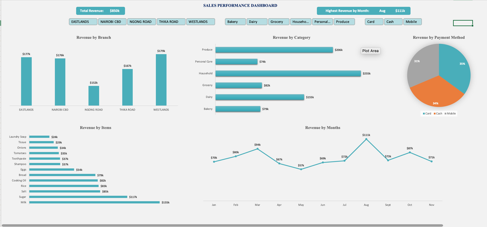

# Sales Performance Dashboard (Excel)

## Problem
The business needed a clear way to track sales performance, revenue trends, and key KPIs across time and products.

## Dataset
Transactional sales data containing order date, product, quantity, revenue, and region.

## Tools Used
- Microsoft Excel
- Pivot Tables
- Power Query
- Charts & KPIs

## Process
- Cleaned and validated raw sales data
- Created pivot tables for analysis
- Built an interactive dashboard with KPIs and monthly trends

## Key Insights
- Identified top-performing products by revenue
- Highlighted months with declining sales
- Revealed performance differences across regions

## Dashboard Preview

